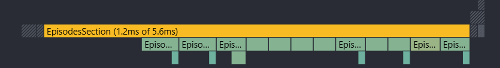
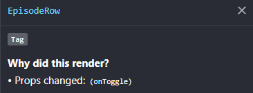
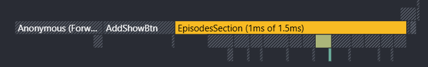
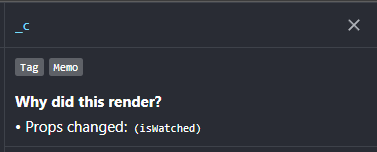
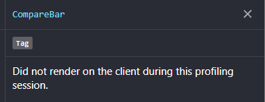
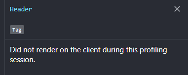
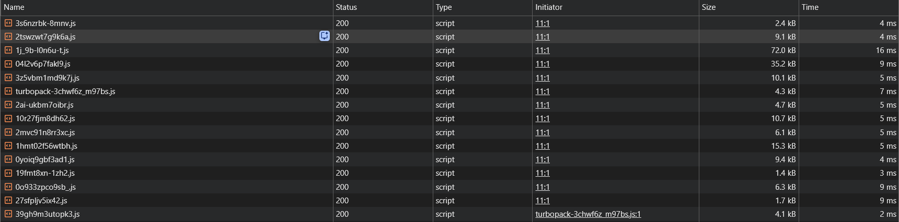
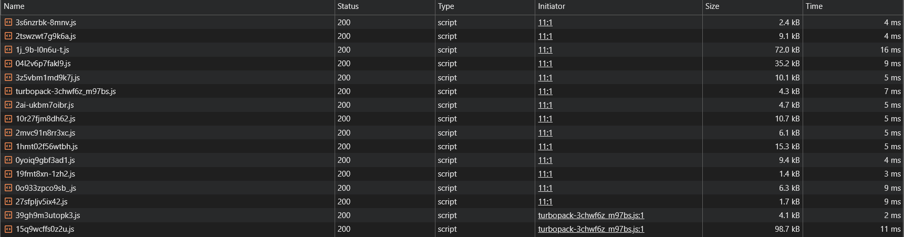

# Bingeria 🍿

Bingeria je Next.js aplikacija za pregled i pretraživanje serija, spremanje serija na watchlist te pisanje recenzija.

**Live demo:** [bingeria.vercel.app](https://bingeria.vercel.app/)

Podaci o serijama dohvaćaju se s javnog [TVmaze API-ja](https://www.tvmaze.com/api).

## Funkcionalnosti

- katalog i pretraga serija s debounceom
- detalji serije
- watchlist s trajnom pohranom u JSON datoteci
- dodavanje i uklanjanje serija pomoću Server Actions
- dodavanje, uređivanje i brisanje recenzija
- React Hook Form + Zod validacija na klijentu i serveru
- statistika i sortiranje watchlista
- dark/light tema koja ostaje spremljena nakon navigacije i refresha
- usporedba do 3 serije putem globalnog comparison bara
- prikaz epizoda po sezonama
- trajno spremanje odgledanih epizoda
- optimistično ažuriranje watched stanja
- lazy-loaded grafikon prosječnih ocjena po sezonama
- route-specific loading i prilagođeni error/404 prikazi
- responzivan dizajn
- dodavanje na watchlist radi i bez JavaScripta
- prvih 10 stranica detalja serije statički se generira pomoću `generateStaticParams`

## Tehnologije

Next.js, React, TypeScript, Tailwind CSS, Zustand, TanStack Query, React Hook Form, Zod, Recharts, Sonner, Iconify i TVmaze API.

## Korištenje AI alata

AI alati korišteni su kao pomoć tijekom razvoja projekta, prvenstveno za:

- pomoć pri pojedinim UI i styling odlukama koje bih mogao implementirati i samostalno, ali uz više vremena
- pomoć pri pisanju i uređivanju README dokumentacije
- završni code review, pronalaženje i ispravljanje neprimijećenih problema i edge caseova te provjeru zadovoljavanja zahtjeva zadatka
- pomoć pri poboljšanju pristupačnosti sučelja, uključujući `aria-*` atribute, focus stanja i druge accessibility detalje
- pomoć oko dijela details stranice koji prikazuje prosječnu ocjenu po sezoni (konkretan način računanja i rad s recharts paketom)
- analizu i rješavanje problema vezanog uz istovremeni rad `loading.tsx` skeletona i `Add to watchlist` funkcionalnosti bez JavaScripta

Posebno kod tog problema AI je korišten za analizu mogućih rješenja i Next.js ponašanja, nakon čega je odabrano rješenje koje zadržava loading skeleton, Server Action bez JavaScripta i zajednički details UI.

## Pokretanje projekta

```bash
git clone https://github.com/jcelic/bingeria
cd bingeria
npm install
npm run dev
```

Aplikacija je zatim dostupna na:

```text
http://localhost:3000
```

Production build:

```bash
npm run build
```

## Struktura projekta

```text
bingeria/
├── data/
│   ├── watchlist.json
│   └── watched.json
└── src/
    ├── app/
    ├── components/
    ├── hooks/
    ├── lib/
    │   ├── actions/
    │   ├── api/
    │   ├── data/
    │   ├── utils/
    │   └── validations/
    ├── store/
    └── types/
```

### Zašto je tražilica Client Component, a lista rezultata nije?

Tražilica mora biti Client Component jer koristi React hookove za kontrolirani input, debounce i promjenu URL-a te mora reagirati na korisnikov unos.

Lista rezultata ne treba biti Client Component jer sama ne koristi React state, event handlere ni druge client-side hookove. Server čita `q` parametar iz URL-a, dohvaća rezultate s TVmaze API-ja i renderira ih na serveru. Na taj način se API ne dohvaća iz preglednika.

### Čemu služi grupiranje ruta bez utjecaja na URL?

Route groups služe za organizaciju povezanih ruta i dijeljenje zajedničkog layouta bez dodavanja naziva grupe u URL.

Zato:

```text
src/app/(info)/about
src/app/(info)/rules
```

daje URL-ove:

```text
/about
/rules
```

umjesto `/info/about` i `/info/rules`.

## Screenshotovi

### Katalog


### Details serije


### Watchlist


## Globalno stanje

Za temu i usporedbu serija koristi se Zustand.

Comparison store sprema samo ID-eve odabranih serija, umjesto cijelih objekata dobivenih s TVmaze API-ja. ID je minimum potreban za pamćenje odabranih serija, dok se podaci o serijama dohvaćaju odvojeno pomoću TanStack Queryja.

Na taj način se server state ne duplicira u globalnom client storeu, a Zustand ostaje zadužen samo za stvarno globalno UI stanje.

Komponente koriste selectore i "pretplaćuju" se samo na dio storea koji im je potreban.

## Server Actions i klijentske mutacije

Server Actions koristio bih kada želim jednostavno izvršiti neku operaciju direktno na serveru, poput obrade forme, spremanja ili izmjene podataka u bazi, bez potrebe za izradom zasebnog API endpointa. Dobar su izbor kada želim napraviti server-side operaciju bez potrebe za dodatnim upravljanjem podacima na klijentskoj strani, primjerice cacheiranjem, refetchom ili optimistic updateom.

React Query koristio bih kada aplikacija ima dinamičnije podatke koji se češće dohvaćaju ili mijenjaju i kada mi je bitno bolje upravljanje tim podacima na klijentu. Tu su korisni cacheiranje, loading i error stanja, refetch, invalidacija cachea te optimistic update. Zbog toga je React Query praktičniji kod interaktivnih dijelova aplikacije, poput dashboarda, lista s filtriranjem i paginacijom ili podataka koji se trebaju često osvježavati bez ponovnog učitavanja stranice.

## Profiliranje i optimizacija renderiranja

Mjerenje je napravljeno u React DevTools Profileru za istu interakciju: promjenu jedne epizode u "odgledano".

### Prije optimizacije

Prije uvođenja `memo` na `EpisodeRow` i `useCallback` za `onToggle`, promjena jedne epizode uzrokovala je ponovno renderiranje svih prikazanih `EpisodeRow` komponenti.

- ukupno trajanje commita: **5.6 ms**
- `EpisodesSection`: **1.2 ms**
- ponovno renderirane `EpisodeRow` komponente: **12**
- Profiler razlog za `EpisodeRow`: `Props changed: (onToggle)`
- Profiler razlog za `EpisodesSection`: `Hooks 16 and 23 changed`





Profiler je pokazao da se referenca `onToggle` mijenjala prilikom renderiranja roditeljske komponente, zbog čega su svi redovi dobivali promijenjen prop.

### Nakon optimizacije

Nakon dodavanja `memo` na `EpisodeRow` i stabiliziranja `onToggle` funkcije pomoću `useCallback`, ista interakcija ponovno renderira samo red kojem se stvarno promijenilo watched stanje.

- ukupno trajanje commita: **1.5 ms**
- `EpisodesSection`: **1.0 ms**
- ponovno renderirane `EpisodeRow` komponente: **1**
- Profiler razlog za taj red: `Props changed: (isWatched)`
- `EpisodesSection` se i dalje renderira zbog `Hooks 16 and 23 changed`





## Izolacija Zustand stanja

Promjena teme profilirana je dok je `CompareBar` bio prikazan. React DevTools za `CompareBar` pokazuje:

```text
Did not render on the client during this profiling session.
```

To potvrđuje da promjena teme ne uzrokuje ponovno renderiranje CompareBar komponente, pa se time ne renderira ni badge s brojem odabranih serija koji se nalazi unutar nje.



Napravljen je i obrnuti test. Uklanjanje serije iz usporedbe ponovno je renderiralo `CompareBar`, dok se `Header` nije renderirao:

```text
Did not render on the client during this profiling session.
```



## Lazy-loaded grafikon

Grafikon prosječnih ocjena po sezonama učitava se tek kada ga korisnik zatraži.

Prije klika na gumb za prikaz grafikona njegov JavaScript nije prisutan među početnim Network requestovima.



Nakon klika preglednik dohvaća dodatni JavaScript chunk veličine približno **98.7 kB**.



Time kod Recharts grafikona nije dio početnog JavaScript bundlea details stranice, nego se učitava tek kada je potreban.
